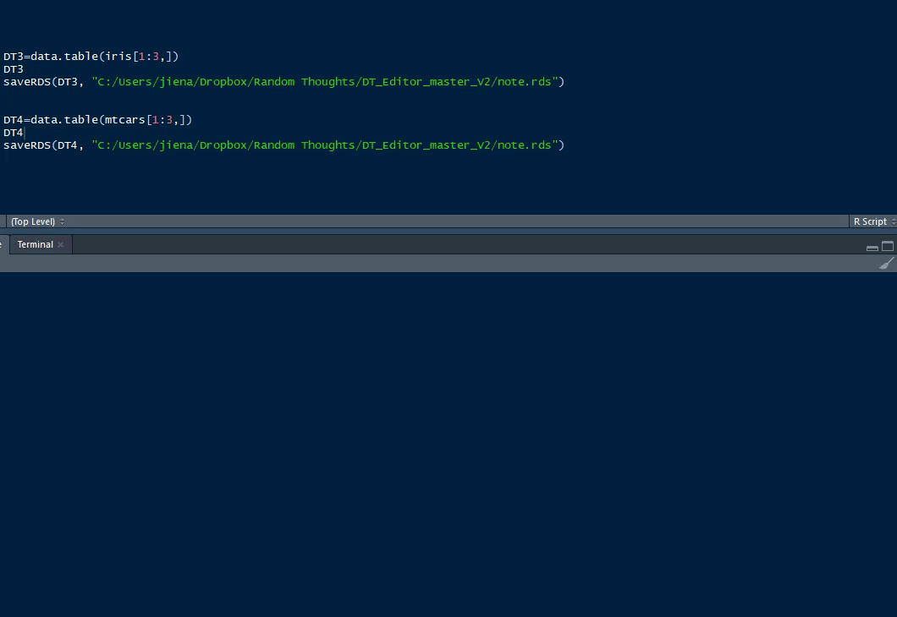

# Deutsche_wortschatz_shiny_module

 * This app utilizes an R shiny module that can fit for any data.table.  
 You just need to create your data.table and load it to the same location of your shiny app as note_words.rds
 
 
 * This app is intended as a repository for my personal German vocabulary builder. It is a modification of Jiena McClellan's *DT-Editor* shiny module. 
 
 * You can clone this repository and use it to build your peronal vocabulary builder.  
 
 * Comments and suggestions are welcome. Use *GitHub.com/rccline/Deutsche_Wortschatz/issues* to file a comment.   
 
# Acknowledgement
From [Shiny developer Jiena McLellan](https://github.com/jienagu/DT-Editor) 

## For example:^[From Jiena McLellan <https://github.com/jienagu/DT-Editor>]
```
 DT3=data.table(iris[1:3,])
 saveRDS(DT3, "path of your shiny app/note.rds")
```

